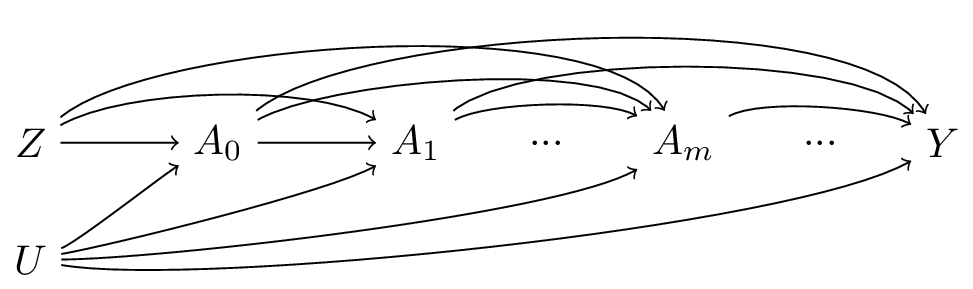

Description

G-estimation of structural mean models (SMMs) is one method of estimating the
causal effect of a time-varying treatment on an outcome using instrumental
variable analysis:

  

<b>Figure 1. Direct acyclic graph with a time-fixed instrument (Z), 
time-varying exposure (A), time-fixed outcome (Y), and time-fixed 
treatment-outcome confounder (U)</b>

  
Simulated Data Examples

R code is provided to replicate the simulations presented in Appendix 3 of [Mendelian randomization with repeated measures of a time-varying exposure: an application of structural mean models](https://doi.org/10.1097/ede.0000000000001417).

The simulations assess the use of structural mean models (SMMs) when conducting Mendelian randomization analysis of time-varying exposures. In all simulations, we consider data-generating models with three relevant exposure time points and assess under which conditions we can identify the causal effect of interest. The following table provides a summary of the causal estimand of interest and the assumptions made in the data-generating models for each simulation:

| Simulation | Causal estimand of interest | # of exposure measurements considered in the model | Instrument-exposure relationship changes over time? | Effect of exposure modified by previous exposure? | Presence of time-varying outcome-exposure confounding? |
| :---: | :---: | :---: | :---: | :---: | :---: |
| A.3.1 | Point effect | One | Yes | No | No | 
| A.3.2	| Period effect	| All (three)	| Yes	| No	| No |
| A.3.3	| Period effect	| All (three)	| Yes	| No	| Yes |
| A.3.4	| Period effect	| All (three)	| Yes	| Yes	| No |
| A.3.5	| Period effect	| One	| Yes	| No	| No |
| A.3.6	| Period effect	| One	| No	| No	| No |
| A.3.7	| Period effect	| Subset (two)	| Yes	| No | No |
| A.3.8	| Period effect	| Subset (two)	| No	| No | No |
| A.3.9	| Period effect	| Subset (two)	| Yes a	| No	| No |

a Instrument-exposure relationship changes over certain (but not all) time intervals